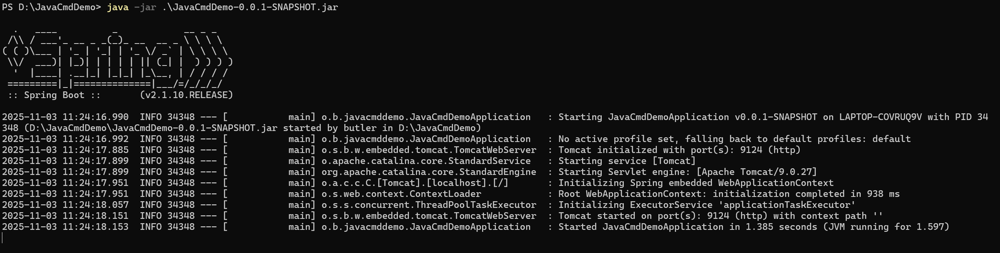
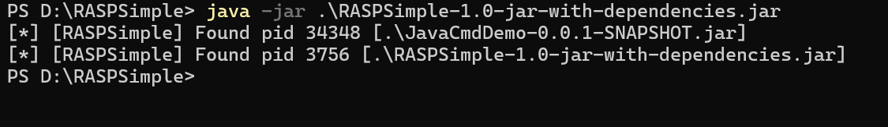
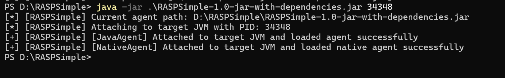
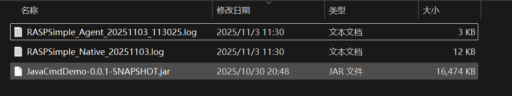
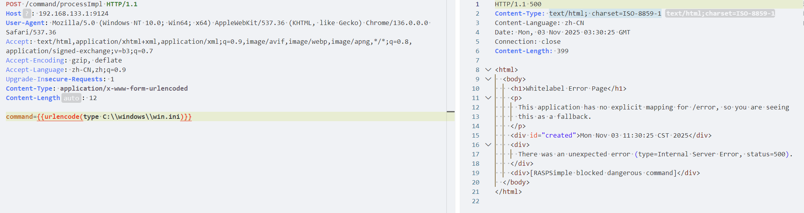
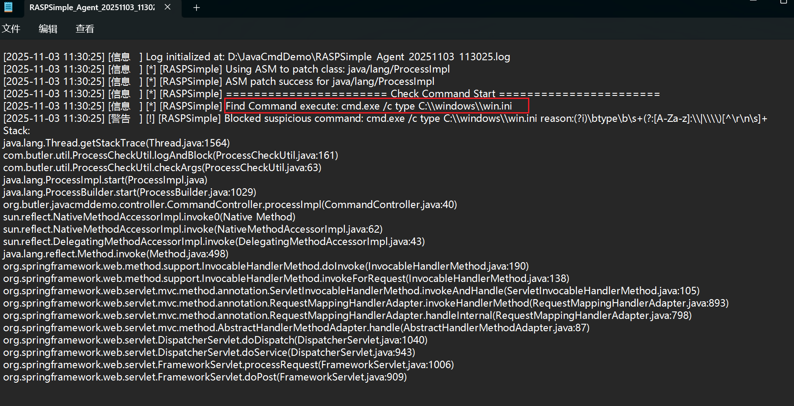
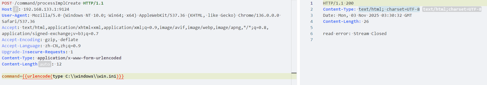
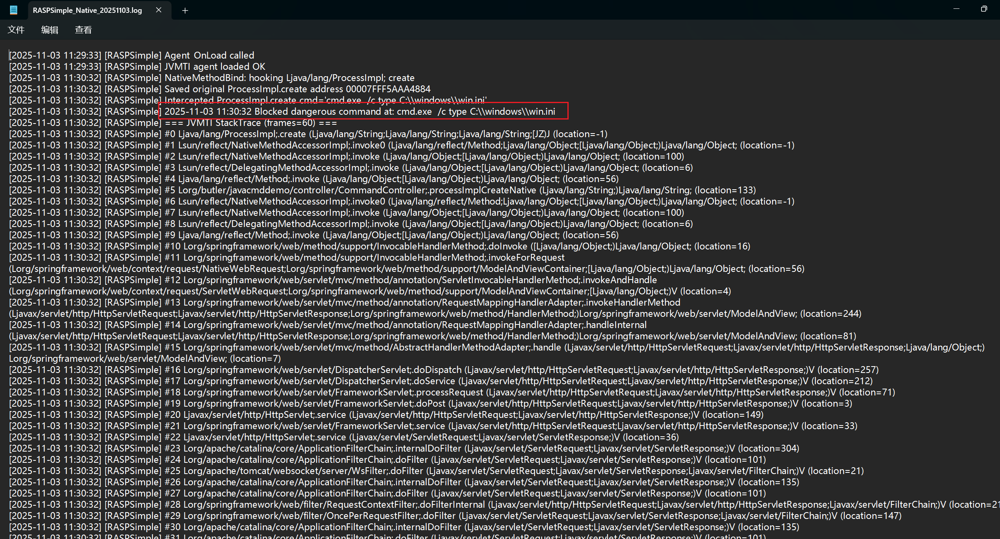

# RASPSimple

RASPSimple是一个简易的在Java应用程序上阻止命令执行注入攻击的JavaAgent，能有效的防止Java层和Native层的命令注入攻击。

- Java层使用 Java Insturment API 在类加载/调用阶段获取 Java层的字节码使用ASM API进行动态插装Hook。
- Native层使用 JVMTI API 在NativeMethodBind阶段(Java层和Native本地方法绑定时)对Native进行插装Hook。

# 快速上手

permain方式：

```bash
# windows
java -jar -javaagent:"D:\\rasp\RASPSimple-1.0-jar-with-dependencies.jar" -agentpath:"D:\\rasp\native/librasp_agent.dll"  JavaCmdDemo-0.0.1-SNAPSHOT.jar

# linux
java -jar -javaagent:"/rasp/RASPSimple-1.0-jar-with-dependencies.jar" -agentpath:"/rasp/native/librasp_agent.so"  JavaCmdDemo-0.0.1-SNAPSHOT.jar
```

agentmain方式：

```bash
java -jar RASPSimple-1.0-jar-with-dependencies.jar [pid]
```

# 功能特性

已集成的功能特性

- 针对Java层 java.lang.ProcessImpl#start 的hook防护

- 针对Window java底层 java.lang.ProcessImpl#<init> 的hook防护
- 针对Linux java底层 java.lang.UNIXProcess#<init> 的hook防护
- 针对Windows Java Native层 ProcessImpl_md.c#Java_java_lang_ProcessImp create 的hook防护
- 针对Linux Java Native层 UNIXProcess_md.c#java_lang_UNIXProcess forkAndExec 的hook防护
- Java函数已经被JVM加载后的再次Hook
- 日志记录命令执行的参数和执行路径的调用栈
- 应用程序运行环境为jre时的Agent Attach
- permain和agentmain俩种方式的attach

计划集成的功能特性

- [ ] Native函数create forAndExec已经被JVM加载后的再次Hook
- [ ] 调用通义千问对命令执行参数和调用栈分析并评分
- [ ] 黑名单字典优化

# 编译

RASPSimple Agent：

```bash
mvn clean package
```

Native Agent

- windows：powershell

```powershell
gcc -shared -fPIC -I"$env:JAVA_HOME/include" -I"$env:JAVA_HOME/include/win32" -static -static-libgcc -static-libstdc++ -o librasp_agent.dll rasp_agent.c
```

- Linux：

```bash
gcc -shared -fPIC -I$JAVA_HOME/include -I$JAVA_HOME/include/linux -o librasp_agent.so rasp_agent.c
```

RASP应用目录示例

```powershell
RASPSimple/
├── RASPSimple-1.0-jar-with-dependencies.jar
├── native
│   ├── librasp_agent.dll
│   ├── librasp_agent.so
```

# 使用示例

启动Java应用程序，JavaCmdDemo-0.0.1-SNAPSHOT.jar



运行RASP程序可以看到系统中运行的Java进程。

```powershell
java -jar .\RASPSimple-1.0-jar-with-dependencies.jar
```



对想要防护的Java经常Attach

```powershell
java -jar .\RASPSimple-1.0-jar-with-dependencies.jar 34348
```



如果有行为对目标应用产生攻击将会在应用程序同级目录下产生日志：

- RASPSimple_Agent.log为Java应用层的防护日志
- RASPSimple_Native.log为Native层的防护日志



如果针对Java层的命令执行攻击行为，例如文件读取。会在RASPSimple_Agent.log日志中记录攻击的参数和调用栈





如果针对Native层的命令执行攻击行为，例如文件读取。会在RASPSimple_Native.log日志中记录攻击的参数和调用栈





# 参考文章

[https://xuanyuanli.cn/pages/8ba834/](https://xuanyuanli.cn/pages/8ba834/)

[https://github.com/pen4uin/java-memshell-generator](https://github.com/pen4uin/java-memshell-generator)

[https://yzddmr6.com/posts/rasp-nativemethodprefix-bypass/](https://yzddmr6.com/posts/rasp-nativemethodprefix-bypass/)

[https://i.blackhat.com/BH-US-23/Presentations/US-23-LI-Low-Level-RASP.pdf](https://i.blackhat.com/BH-US-23/Presentations/US-23-LI-Low-Level-RASP.pdf)
